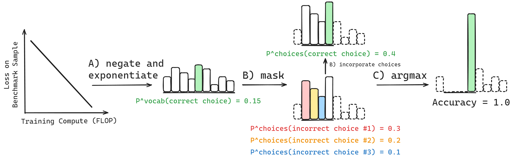

# Why Has Predicting Downstream Capabilities of Frontier AI Models with Scale Remained Elusive?



This repository contains code and figures for our paper
[Why Has Predicting Downstream Capabilities of Frontier AI Models with Scale Remained Elusive?](https://arxiv.org/abs/2406.04391)
by Rylan Schaeffer, Hailey Schoelkopf, Brando Miranda, Gabriel Mukobi, Varun Madan, Adam Ibrahim, Herbie Bradley, Stella Biderman and Sanmi Koyejo.

[](https://arxiv.org/abs/2406.04391)

[**Setup**](#installation) | [**Usage**](#usage) | [**Contributing**](#contributing) | [**Citing**](#citing) | [**Contact**](#contact)


## Installation

1. (Optional) Update conda:

`conda update -n base -c defaults conda -y`

2. Create and activate the conda environment:

`conda env create --file environment.yml -y && conda activate elusive`

4. Update pip.

`pip install --upgrade pip`

5. Install some additional packages:

`pip install bitsandbytes sentencepiece`

6. (Optional) To run evals, initialize EleutherAI's `lm-evaluation-harness`:

`git submodule update --init --recursive`

Change into the directory and install `lm-evaluation-harness`:

`cd submodules/lm-evaluation-harness && pip install -e . && cd ../..`

7. Login to `wandb`:

`wandb login`

## Data

Data will be provided once the paper is accepted and published. For early access, please contact the 
authors [see Contact below](#contact).

## Code

This project's code has three broad stages:

1. **Collecting Language Model Scores on NLP Benchmarks**: Running language model families on standard LLM benchmarks and collating the per-sample results.
2. **Computing Compute-Score Correlations**: For each 4-tuple of `(language model family, NLP benchmark, correlation metric, performance score)`, we 
  compute the per-sample correlations between scores and compute over the model family. This is done using [scripts/compute_correlations_between_sample_scores_and_compute.py](scripts%2Fcompute_correlations_between_sample_scores_and_compute.py)
  and [W&B sweeps](sweeps/correlations_between_sample_scores_and_compute)
3. **Analyzing Compute-Score Correlations**: We analyze the results of the correlations in the paper and generate figures using the Python scripts in [notebooks](notebooks).

## Contributing

Contributions are welcome! Please format your code with [black](https://github.com/psf/black).

## Citing

To cite this work, please use:

```bibtex
@misc{schaeffer2024predictingdownstreamcapabilitiesfrontier,
      title={Why Has Predicting Downstream Capabilities of Frontier AI Models with Scale Remained Elusive?}, 
      author={Rylan Schaeffer and Hailey Schoelkopf and Brando Miranda and Gabriel Mukobi and Varun Madan and Adam Ibrahim and Herbie Bradley and Stella Biderman and Sanmi Koyejo},
      year={2024},
      eprint={2406.04391},
      archivePrefix={arXiv},
      primaryClass={cs.LG},
      url={https://arxiv.org/abs/2406.04391}, 
}
```

Note: We created a new clean repository for the review process; thus, this repo's commit history is not representative
of each individual's contributions.

## Contact

Questions? Comments? Interested in collaborating?
Open an [issue](https://github.com/RylanSchaeffer/KoyejoLab-Why-Has-Predicting-Downstream-Capabilities-Remained-Elusive/issues) or email rschaef@cs.stanford.edu and sanmi@cs.stanford.edu.
